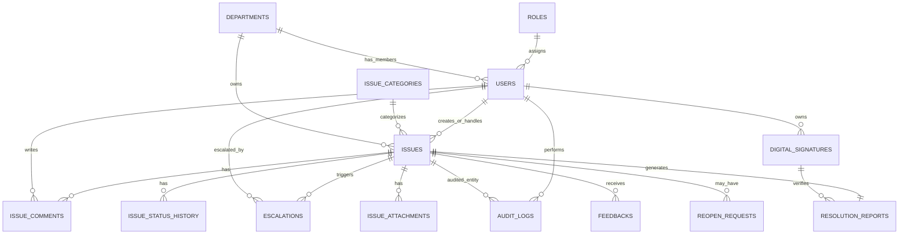

# Smart Public Issue Reporting System

## 1) Project Scope
Digital grievance platform for Panchayath governance that enables:
- Citizens to report and track public issues.
- Secretary to assign, monitor, escalate, and manage deadlines.
- Section Clerk/Engineer to process assigned issues with proof and digital sign-off.
- Admin to control master data, users, reports, and performance monitoring.

## 2) System Architecture

### Logical Architecture
1. Presentation Layer: `Next.js` web app (citizen portal + actor dashboards).
2. API Layer: `Next.js Route Handlers` (auth, issue workflows, notifications, reports).
3. Business Layer: service modules for assignment, escalation, SLA/deadline engine, duplicate detection, and audit logging.
4. Data Layer: PostgreSQL (transactional data), object storage for images/PDFs, Redis for queues/reminders.

### Deployment Components
1. Web/API server.
2. Background worker (deadline reminders + escalation jobs).
3. Notification gateway (email/SMS/push adapters).
4. File storage service for uploaded images and generated PDFs.

## 3) RBAC Model
- Citizen: submit complaint, track by ID, receive updates, feedback, reopen request.
- Secretary: view all issues, filter, assign official, set/extend deadlines, escalate/reassign, approve reopen.
- Section Clerk/Engineer: view assigned issues, update status, add progress, upload proof, digitally sign final resolution.
- Admin: full access for user management, category management, analytics, transparency reporting, audit monitoring.

## 4) Core Workflow
1. Citizen submits issue with category, description, priority, image, location, contact/anonymous.
2. System creates `Track ID`, sets status `Pending`, runs duplicate check.
3. Secretary reviews issue, assigns department/official, sets resolution deadline.
4. Assigned official receives notification and works issue with progress updates.
5. Reminder engine sends pre-deadline alerts.
6. If deadline passes unresolved, status changes to `Overdue`; escalation count increments and Secretary alerted.
7. Official uploads proof + final report and applies digital signature to mark `Resolved`.
8. Citizen receives completion update, views proof, provides rating/comments, and may request reopen.
9. Secretary approves/rejects reopen request; approved cases return to active workflow.

## 5) ER Diagram (Cardinality)

## 6) Database Schema (PK/FK)

### `roles`
- `id` (PK)
- `name` (unique) -> `ADMIN | SECRETARY | ENGINEER | CITIZEN`

### `departments`
- `id` (PK)
- `name` (unique)

### `users`
- `id` (PK, UUID)
- `role_id` (FK -> `roles.id`)
- `department_id` (FK -> `departments.id`, nullable)
- `name`
- `email` (unique, nullable for citizen-anonymous flows)
- `phone` (nullable)
- `password_hash` (nullable for citizen-anonymous)
- `is_active`
- `created_at`, `updated_at`

### `issue_categories`
- `id` (PK)
- `name` (unique)
- `department_id` (FK -> `departments.id`)
- `is_active`

### `issues`
- `id` (PK, UUID)
- `track_id` (unique)
- `citizen_user_id` (FK -> `users.id`, nullable for anonymous)
- `category_id` (FK -> `issue_categories.id`)
- `department_id` (FK -> `departments.id`, nullable until assignment)
- `assigned_to_user_id` (FK -> `users.id`, nullable)
- `reported_email` (nullable)
- `reported_phone` (nullable)
- `is_anonymous`
- `priority` (`LOW | HIGH | URGENT`)
- `status` (`PENDING | IN_PROGRESS | RESOLVED | OVERDUE | REOPEN_REQUESTED`)
- `title`
- `description`
- `location_text`
- `latitude`, `longitude` (nullable)
- `resolution_deadline` (nullable)
- `resolved_at` (nullable)
- `escalation_count` (default 0)
- `duplicate_of_issue_id` (FK -> `issues.id`, nullable)
- `created_at`, `updated_at`

### `issue_status_history`
- `id` (PK)
- `issue_id` (FK -> `issues.id`)
- `old_status`
- `new_status`
- `changed_by_user_id` (FK -> `users.id`, nullable for system jobs)
- `remarks`
- `changed_at`

### `issue_comments`
- `id` (PK)
- `issue_id` (FK -> `issues.id`)
- `user_id` (FK -> `users.id`)
- `comment`
- `created_at`

### `issue_attachments`
- `id` (PK)
- `issue_id` (FK -> `issues.id`)
- `file_url`
- `file_type` (`REPORT_IMAGE | PROOF_IMAGE | OTHER`)
- `uploaded_by_user_id` (FK -> `users.id`, nullable)
- `uploaded_at`

### `escalations`
- `id` (PK)
- `issue_id` (FK -> `issues.id`)
- `escalated_to_user_id` (FK -> `users.id`)
- `trigger_type` (`DEADLINE_BREACH | MANUAL`)
- `notes`
- `escalated_at`

### `digital_signatures`
- `id` (PK)
- `user_id` (FK -> `users.id`)
- `signature_hash`
- `issued_at`
- `revoked_at` (nullable)

### `resolution_reports`
- `id` (PK)
- `issue_id` (FK -> `issues.id`, unique)
- `summary`
- `proof_attachment_id` (FK -> `issue_attachments.id`)
- `signed_by_user_id` (FK -> `users.id`)
- `signature_id` (FK -> `digital_signatures.id`)
- `pdf_url`
- `generated_at`

### `feedbacks`
- `id` (PK)
- `issue_id` (FK -> `issues.id`)
- `rating` (1..5)
- `comment`
- `created_at`

### `reopen_requests`
- `id` (PK)
- `issue_id` (FK -> `issues.id`)
- `requested_by_contact`
- `reason`
- `status` (`PENDING | APPROVED | REJECTED`)
- `reviewed_by_user_id` (FK -> `users.id`, nullable)
- `reviewed_at` (nullable)
- `created_at`

### `notifications`
- `id` (PK)
- `user_id` (FK -> `users.id`, nullable)
- `issue_id` (FK -> `issues.id`, nullable)
- `channel` (`EMAIL | SMS | IN_APP`)
- `subject`
- `body`
- `status` (`QUEUED | SENT | FAILED`)
- `sent_at` (nullable)

### `audit_logs`
- `id` (PK)
- `actor_user_id` (FK -> `users.id`, nullable)
- `entity_type`
- `entity_id`
- `action`
- `old_value_json`
- `new_value_json`
- `ip_address`
- `created_at`

## 7) Technology Stack (Mini Project Friendly)
- Frontend: `Next.js 16`, `React 19`, `JavaScript (JSX)`, `Tailwind CSS`.
- Backend: `Next.js API Routes` + service modules.
- DB: `PostgreSQL` with `Prisma ORM`.
- Auth: `NextAuth` or custom JWT with bcrypt hashed passwords and role claims.
- Jobs/Queue: `BullMQ` + `Redis` for reminders/escalations.
- File/PDF: `S3-compatible storage` + `pdf-lib` or `puppeteer`.
- Notifications: SMTP email + optional SMS gateway.
- Deployment: Vercel/Render/Fly + managed PostgreSQL.

## 8) Security Considerations
- Password hashing with `bcrypt` and strong password policy.
- Role-based authorization guard on every protected route/API.
- Input validation and output encoding to block injection/XSS.
- CSRF protection for authenticated stateful operations.
- Rate limiting on login/report endpoints.
- Signed URL or private bucket access for complaint/proof images.
- Immutable audit logs for sensitive actions.
- Encrypt sensitive data at rest and enforce HTTPS in transit.

## 9) Future Enhancements
- AI-assisted issue category prediction and severity scoring.
- GIS map dashboard with hotspot clustering.
- Mobile app with offline report capture.
- WhatsApp bot integration for complaint updates.
- Auto-assignment based on workload and geo zone.
- Public transparency portal with anonymized SLA analytics.

## 10) Delivery Plan (Step-by-Step)
1. Authentication module for internal actors (current step).
2. Database setup with Prisma models and migrations.
3. Citizen complaint submission with Track ID + file upload.
4. Secretary assignment + deadline workflow.
5. Engineer progress updates + digital signature finalization.
6. Escalation scheduler + notification services.
7. Citizen tracking page + timeline + feedback/reopen.
8. Admin dashboards + monthly transparency reporting.
